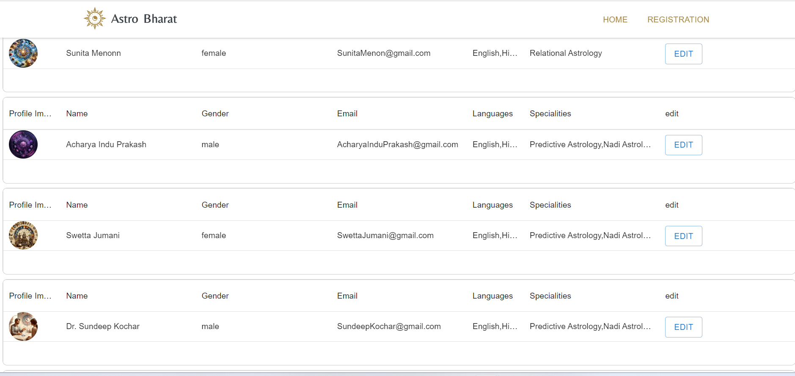
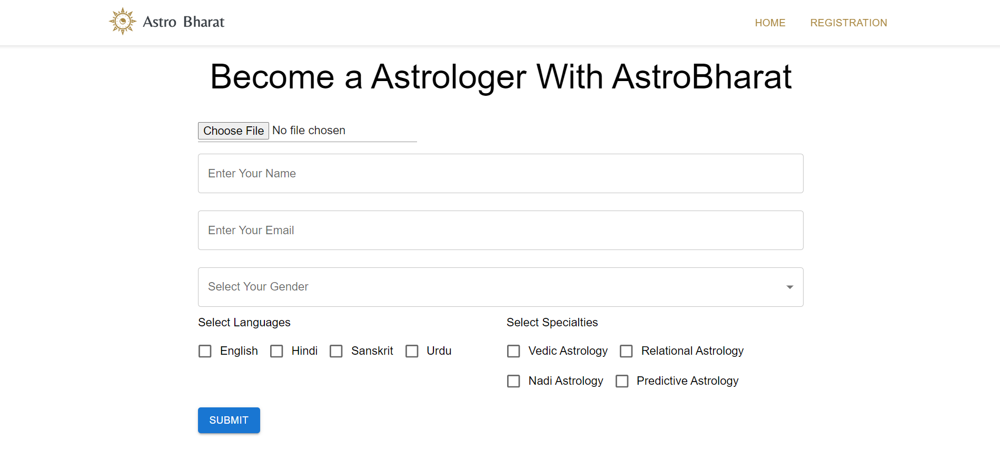
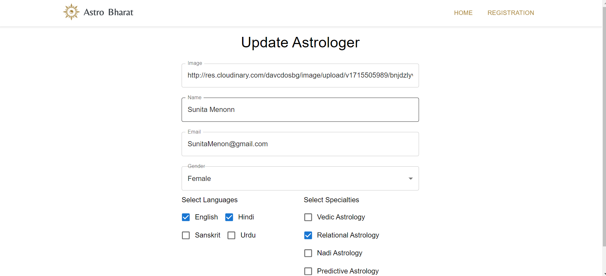

# Astrologer Website

Welcome to Astrologer, a web application where users can add, view, and edit astrological data.

## Deployment Link

[Link to the deployed website](https://astro-bharat-frontend.vercel.app/)

## Features

- **Add Data:** Users can add new astrological data to the system.
- **View Data:** All added data can be viewed in a structured format.
- **Edit Data:** Users have the ability to edit existing astrological data.
- **Image Storage:** Utilizes Cloudinary for storing images related to astrological data.

## Screenshots

**Landing page**

**Register New Astrologer Page**

**Edit Astrologer page**

## Tech Stack

### Frontend
- React.js
- TypeScript
- Material UI
- HTML
- CSS

### Backend
- Node.js
- Express
- MongoDB
- TypeScript

## Getting Started

To run this project locally, follow these steps:

1. Clone this repository.
2. Navigate to the project directory.
3. Install dependencies by running: npm install
4. Start the frontend development server: npm run dev

## Contributing

Contributions are welcome! If you'd like to contribute to this project, please follow these steps:

1. Fork this repository.
2. Create a new branch for your feature or bug fix.
3. Make your changes and commit them.
4. Push your changes to your fork.
5. Submit a pull request.
   